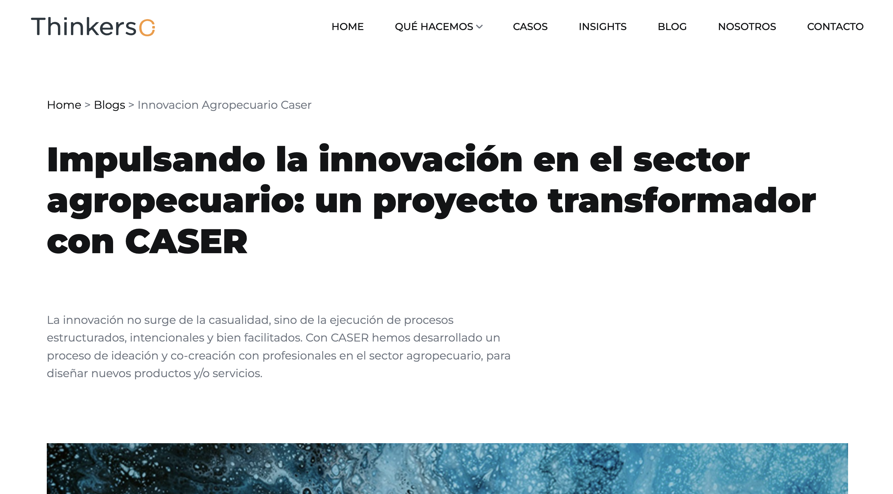

# Blog detalle

## Descripción

Página de un artículo específico del blog de Thinkers Co. donde se muestra la información detallada de dicho artículo.

Incluye:
- Navegación principal del sitio
- Breadcrumbs
- Título y descripción del blog
- Artículos relacionados
- Sección CTA (Call To Action)
- Footer con información de contacto y redes sociales

---

## Tecnologías utilizadas

- HTML5
- CSS3
- JavaScript (vanilla + plugins)
- jQuery

### Librerías y plugins

- Bootstrap
- Swiper.js
- LightGallery
- GSAP (ScrollTrigger, ScrollSmoother, SplitText)
- Isotope

---
## Capturas de pantalla
### Mobile


### Tablet


### Ordenador


---

## Estructura relevante

```bash
assets/
 ├── css/
 │    ├── plugins/
 │    └── style.css
 ├── js/
 │    ├── plugins/
 │    └── main.js
 └── img/

 blogs/
 ├── blog-detalle/    
 └── index.html   
```

---

## Estructura de la página

### 1. Header / Navbar

- Logo
- Menú de navegación principal

### 2. Sección Blog

- Breadcrumbs
- Título e introducción
- Imagen
- Descripción
- Conclusión
- Galería de imágenes
- Vídeo

### 3. Artículos relacionados
Sección para ir a otros artículos (blogs) relacionados con el que te encuentras actualmente.

También dispone de un botón "ver todos los artículos" para volver a la página de blogs.


### 4. CTA (Call To Action)

Sección para redirigir a contacto:

> Contáctanos →

### 5. Footer

- Información corporativa
- Redes sociales
- Contacto
- Navegación secundaria

---

## Cómo manejar el bloque de vídeo

HTML necesario:
```html
<!-- Start Video Block -->
    <div class="container">
      <div class="cs_parallax">
        <a href="https://player.vimeo.com/video/1096155294?h=b910ce64dd"
          class="cs_video_block cs_style1 cs_video_open cs_bg cs_parallax_bg cs_video_preview_overlay"
          data-src="/assets/img/preview-video.png">
          <span class="cs_player_btn cs_accent_color">
            <span></span>
          </span>
        </a>
      </div>
    </div>
<!-- End Video Block -->
```
Para cambiar el vídeo a reproducir pegar la url en ``href``, y para cambiar la imagen de previsualicación modificar la ruta en ``data-src``.

---
```html
 <!-- Start Video Popup -->
  <div class="cs_video_popup">
    <div class="cs_video_popup_overlay"></div>
    <div class="cs_video_popup_content">
      <div class="cs_video_popup_layer"></div>
      <div class="cs_video_popup_container">
        <div class="cs_video_popup_align">
          <div class="embed-responsive embed-responsive-16by9">
            <iframe class="embed-responsive-item" src="about:blank"></iframe>
          </div>
        </div>
        <div class="cs_video_popup_close"></div>
      </div>
    </div>
  </div>
  <!-- End Video Popup -->
```
> [!IMPORTANT]Importante
> El bloque "Start Video Popup" tiene que estar fuera del div con el id "scrollsmoother-container" porque si no no aparece centrado.

---

## Funcionamiento breadcrumbs

Para que los breadcrumbs funcionen hay que seguir 2 pasos:
1. Poner en el html el siguiente bloque:
```html
<section>
  <div class="container">
    <div id="breadcrumb"></div>
  </div>
</section>
```
2. Al final del body añadir este JavaScript:
```js
<script>
    function generarBreadcrumb() {
      const container = document.getElementById("breadcrumb");
      const path = window.location.pathname.split("/").filter(p => p);

      const ignorar = ["insight-detalle", "caso-detalle", "blog-detalle"];

      let rutaAcumulada = "";
      let breadcrumbHTML = '<a href="/">Home</a>';

      const visibles = path.filter(p => !ignorar.includes(p));

      visibles.forEach((segmento, index) => {
        const esUltimo = index === visibles.length - 1;

        rutaAcumulada += "/" + segmento;

        const texto = decodeURIComponent(segmento)
          .replace(".html", "")
          .replace(/[-_]/g, " ")
          .replace(/\b\w/g, l => l.toUpperCase());

        if (esUltimo) {
          breadcrumbHTML += ` > <span>${texto}</span>`;
        } else {
          breadcrumbHTML += ` > <a href="${rutaAcumulada}">${texto}</a>`;
        }
      });

      container.innerHTML = breadcrumbHTML;
    }

    generarBreadcrumb();
  </script>
```
Lo que está haciendo este código es coger la url de la página actual y dividirla cada vez que aparece una barra ``/``.

---

Con la constante  
```js
const ignorar = ["insight-detalle", "caso-detalle", "blog-detalle"];
 ``` 
se ignora cuando en la url aparece alguna de estas cadenas de texto, ya que son carpetas dentro del proyecto pero no son rutas para el usuario.

---

Para que el breadcrumb se vea mejor, se utilizan estas líneas de código para eliminar los ``.html``, Reemplaza guiones y barras bajas por espacios, y pone en mayúscula la primera letra de cada palabra.
```js
const texto = decodeURIComponent(segmento)
  .replace(".html", "")
  .replace(/[-_]/g, " ")
  .replace(/\b\w/g, l => l.toUpperCase());
```

---

Este if else sirve para crear los links de las páginas anteriores, y dejar como texto normal la página en la que te encuentras.
```js
if (esUltimo) {
  breadcrumbHTML += ` > <span>${texto}</span>`;
} else {
  breadcrumbHTML += ` > <a href="${rutaAcumulada}">${texto}</a>`;
}
```

---

## Título y subtítulo
Para crear los elementos título y subtítulo se necesita este bloque de html:
```html
<div class="container">
  <div class="cs_section_heading cs_style_1">
    <div class="cs_section_heading_text">
      <h2 class="cs_section_title anim_word_writting">
        Título
      </h2>
      <div class="cs_height_80 cs_height_lg_60"></div>
      <p class="cs_text_style_body anim_text">
        Subtítulo
      </p>
    </div>
  </div>
</div>
```
Para cambiar las animaciones hay que usar las clases que empiecen por ``anim_``, por ejemplo ``anim_word_writting``.

Las clases de animaciones existentes son:
- anim_word_writting
- anim_text_writting
- anim_heading_title
- anim_text
- anim_blog
- anim_text_upanddowns
- anim_div_ShowZoom
- anim_div_ShowLeftSide
- anim_div_ShowRightSide
- anim_div_ShowDowns
- anim_div_ShowUps
- anim_text_popup
- reveal

<!-- TODO: explicar animaciones -->
| Nombre de la clase |   Descripción |
| :----------------- | ------------: |
| Fila 1, Col 1      | Fila 1, Col 2 |
| Fila 2, Col 1      | Fila 2, Col 2 |


## Galería de fotos
La galería de fotos es el siguiente bloque:
```html
<div class="container">
  <div class="cs_img_box cs_style_1">
    <div class="cs_img_show">
      <div class="reveal">
        
      </div>
      <div class="reveal">
        
      </div>
    </div>
    <div class="cs_height_30 cs_height_lg_30"></div>
    <div class="cs_img_show">
      <div class="reveal">
        
      </div>
      <div class="reveal">
        
      </div>
    </div>
  </div>
</div>
```
Dentro de los divs con clase ``container`` y ``cs_img_box cs_style_1`` hay 2 divs con la clase ``cs_img_show``, estos divs indican que todo lo que haya dentro de ellos es una sola fila (por lo que en este caso hay 2 filas). Si se quisiera añadir otra fila habría que duplicar el div con clase ``cs_img_show``:

```html
<div class="cs_img_show">
  <div class="reveal">
    
  </div>
  <div class="reveal">
    
  </div>
</div>
```

Después, se encuentra la imagen dentro del div con la clase ``reveal``, siendo esta la animación que hace la imagen.

---

## Artículos relacionados
Los artículos están agrupados en un grid de 3.

Dentro de este div se han de meter los articulos (clase ``cs_featured_case_item``)
```html
<div class="cs_featured_cases_grid">
```

```html
<div class="cs_featured_case_item cs_color_1 anim_div_ShowDowns">
  <a href="RUTA-PÁGINA.html" class="cs_featured_case_link">
    <div class="cs_post cs_style_1">
      <div class="cs_post_thumb">
        
      </div>
      <div class="cs_post_info">
        <h2 class="cs_post_title">Título</h2>
        <p class="cs_m0">
          Descripción corta
        </p>
      </div>
    </div>
  </a>
</div>
```

<!-- TODO:
js: coger los primeros 3 articulos de blog y traerlas a articulos destacados en blog detalle
 -->


---
## Dependencias JS

Incluidas al final del documento:

```
jquery-3.7.0.min.js
isotope.pkg.min.js
swiper.min.js
lightgallery.min.js
gsap + plugins
main.js
```

---

## Personalización

Se puede modificar:

- El contenido del blog → Editando los bloques HTML
- Los estilos → buscando las clases correspondientes en `assets/css/style.css`
- Las animaciones → `assets/js/main.js` + GSAP

---

## Licencia

Uso interno / proyecto corporativo Thinkers Co.