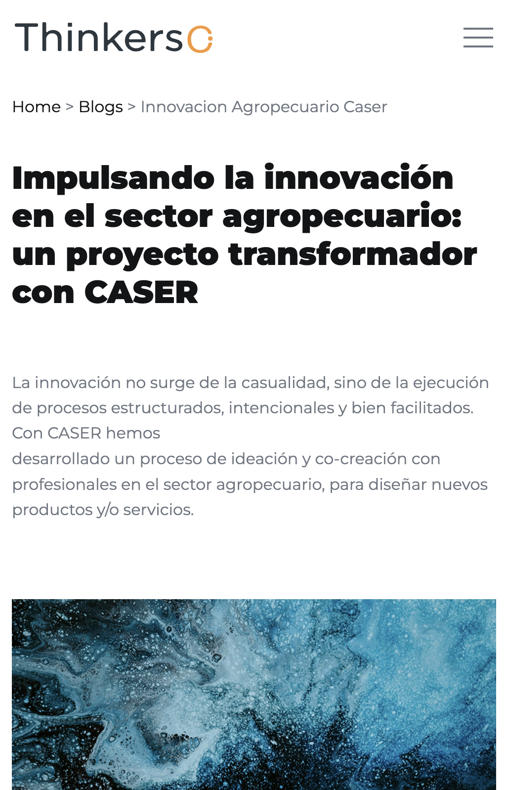

# Blog detalle

## Descripción

Página de un artículo específico del blog de Thinkers Co. donde se muestra la información detallada de dicho artículo.

Incluye:
- Navegación principal del sitio
- Sección CTA (Call To Action)
- Footer con información de contacto y redes sociales

---

## Tecnologías utilizadas

- HTML5
- CSS3
- JavaScript (vanilla + plugins)
- jQuery

### Librerías y plugins

- Bootstrap
- Swiper.js
- LightGallery
- GSAP (ScrollTrigger, ScrollSmoother, SplitText)
- Isotope

---
## Capturas de pantalla
### Mobile


### Tablet


### Ordenador


---

## Estructura relevante

```bash
assets/
 ├── css/
 │    ├── plugins/
 │    └── style.css
 ├── js/
 │    ├── plugins/
 │    └── main.js
 └── img/

 blogs/
 ├── blog-detalle/    
 └── index.html   
```

---

## Estructura de la página

### 1. Header / Navbar

- Logo
- Menú de navegación principal

### 2. Sección Blog

- Breadcrumbs
- Título e introducción
- Imagen
- Descripción
- Galería de imágenes
- Vídeo

### 3. Artículos relacionados
Sección para ir a otros artículos (blogs) relacionados con el que te encuentras actualmente.

También dispone de un botón "ver todos los artículos" para volver a la página de blogs.


### 4. CTA (Call To Action)

Sección para redirigir a contacto:

> Contáctanos →

### 5. Footer

- Información corporativa
- Redes sociales
- Contacto
- Navegación secundaria

---

## Cómo manejar el bloque de vídeo

HTML necesario:
```html
<!-- Start Video Block -->
    <div class="container">
      <div class="cs_parallax">
        <a href="https://player.vimeo.com/video/1096155294?h=b910ce64dd"
          class="cs_video_block cs_style1 cs_video_open cs_bg cs_parallax_bg cs_video_preview_overlay"
          data-src="../../assets/img/preview-video.png">
          <span class="cs_player_btn cs_accent_color">
            <span></span>
          </span>
        </a>
      </div>
    </div>
<!-- End Video Block -->
```

```html
 <!-- Start Video Popup -->
  <div class="cs_video_popup">
    <div class="cs_video_popup_overlay"></div>
    <div class="cs_video_popup_content">
      <div class="cs_video_popup_layer"></div>
      <div class="cs_video_popup_container">
        <div class="cs_video_popup_align">
          <div class="embed-responsive embed-responsive-16by9">
            <iframe class="embed-responsive-item" src="about:blank"></iframe>
          </div>
        </div>
        <div class="cs_video_popup_close"></div>
      </div>
    </div>
  </div>
  <!-- End Video Popup -->
```
> [!IMPORTANT]
> El bloque "Start Video Popup" tiene que estar fuera del div con el id "scrollsmoother-container" porque si no no aparece centrado.

---

## Dependencias JS

Incluidas al final del documento:

```
jquery-3.7.0.min.js
isotope.pkg.min.js
swiper.min.js
lightgallery.min.js
gsap + plugins
main.js
```

---

## Personalización

Se puede modificar:

- El contenido del blog → Editando los bloques HTML
- Los estilos → buscando las clases correspondientes en `assets/css/style.css`
- Las animaciones → `assets/js/main.js` + GSAP

---

## Licencia

Uso interno / proyecto corporativo Thinkers Co.