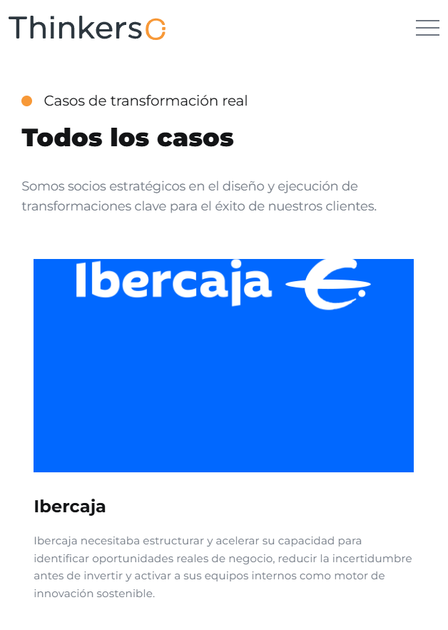
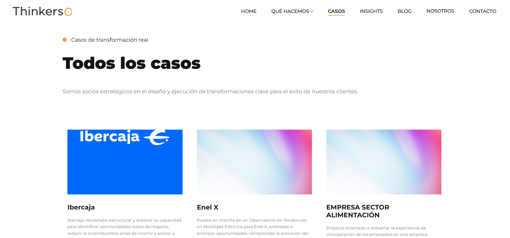

# Casos

## Descripción

Página de listado de todos los casos que ha realizado Thinkers co.

Incluye:
- Navegación principal del sitio
- Título y pequeña descripción de la empresa
- Listado de los casos en formato grid
- Sección CTA (Call To Action)
- Footer con información de contacto y redes sociales

---

## Tecnologías utilizadas

- HTML5
- CSS3
- JavaScript (vanilla + plugins)
- jQuery

### Librerías y plugins

- Bootstrap
- Swiper.js
- LightGallery
- GSAP (ScrollTrigger, ScrollSmoother, SplitText)
- Isotope

---
 ## Capturas de pantalla
### Mobile


### Tablet


### Ordenador

 
---

## Estructura relevante

```bash
assets/
 ├── css/
 │    ├── plugins/
 │    └── style.css
 ├── js/
 │    ├── plugins/
 │    └── main.js
 └── img/

 casos/
 ├── caso-detalle/    
 └── index.html   
```

---

## Estructura de la página

### 1. Header / Navbar

- Logo
- Menú de navegación principal

### 2. Sección Casos

- Título e introducción
- Grid de artículos
- Cada tarjeta caso contiene:
  - Imagen (thumbnail)
  - Título
  - Extracto
  - Enlace a detalle

### 3. CTA (Call To Action)

Sección para redirigir a contacto:

> Contáctanos →

### 4. Footer

- Información corporativa
- Redes sociales
- Contacto
- Navegación secundaria

---

## Cómo añadir un nuevo caso

Duplicar un bloque dentro de:

```html
<div class="cs_featured_cases_grid">
```

Ejemplo:

```html
<div class="cs_featured_case_item cs_color_1 anim_div_ShowDowns">
    <a href="caso-detalle/ibercaja.html" class="cs_featured_case_link">
    <div class="cs_post cs_style_1">
        <div class="cs_post_thumb">
        
        </div>
        <div class="cs_post_info">
        <h2 class="cs_post_title">Título</h2>
        <p class="cs_m0">
            Breve descripción del caso.
        </p>
        </div>
    </div>
    </a>
</div>
```

---

## Dependencias JS

Incluidas al final del documento:

```html
jquery-3.7.0.min.js
isotope.pkg.min.js
swiper.min.js
lightgallery.min.js
gsap + plugins
main.js
```

---

## Personalización

Se puede modificar:

- El contenido de los casos → Editando los bloques HTML
- Los estilos → buscando las clases correspondientes en `assets/css/style.css`
- Las animaciones → `assets/js/main.js` + GSAP

---

## Licencia

Uso interno / proyecto corporativo Thinkers Co.