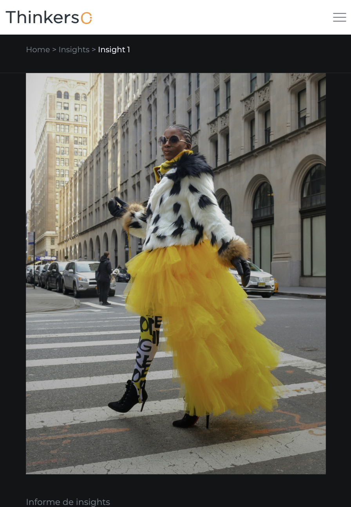

# Insight detalle

## Descripción

Página de un caso específico de todos los casos de Thinkers Co. donde se muestra la información detallada de dicho caso.

Incluye:
- Navegación principal del sitio
- Breadcrumbs
- Imagen
- Título y descripción del insight
- Slider con propuestas de valor
- Sección con formulario para descargar el pdf del insight
- Sección CTA (Call To Action)
- Footer con información de contacto y redes sociales

---

## Tecnologías utilizadas

- HTML5
- CSS3
- JavaScript (vanilla + plugins)
- jQuery

### Librerías y plugins

- Bootstrap
- Swiper.js
- LightGallery
- GSAP (ScrollTrigger, ScrollSmoother, SplitText)
- Isotope

---
## Capturas de pantalla
### Mobile


### Tablet


### Ordenador


---

## Estructura relevante

```bash
assets/
 ├── css/
 │    ├── plugins/
 │    └── style.css
 └── js/
      ├── plugins/
      └── main.js
 
insights/ 
 ├── insights-detalle/
 ├── insight-pdfs/
 └── index.html  
```

---

## Estructura de la página

### 1. Header / Navbar

- Logo
- Menú de navegación principal

### 2. Insight

- Breadcrumbs
- Imagen
- Título e introducción
- Slider con propuestas de valor

### 3. Descarga

- Formulario con datos del usuario (obligatorio rellenar todos los campos)
- Botón de descargar informe
  - Los pdf a descargar se almacenan en la carpeta ``inights-pdfs`` dentro de la carpeta ``insights``

### 4. CTA (Call To Action)

Sección para redirigir a contacto:

> Contáctanos →

### 5. Footer

- Información corporativa
- Redes sociales
- Contacto
- Navegación secundaria

---

## Dependencias JS

Incluidas al final del documento:

```
jquery-3.7.0.min.js
isotope.pkg.min.js
swiper.min.js
lightgallery.min.js
gsap + plugins
main.js
```

---

## Personalización

Se puede modificar:

- El contenido de la página → Editando los bloques HTML
- Los estilos → buscando las clases correspondientes en `assets/css/style.css`
- Las animaciones → `assets/js/main.js` + GSAP

---

## Licencia

Uso interno / proyecto corporativo Thinkers Co.